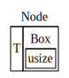

# 鏈結串列 Linked list

鏈結串列是一種基本線性資料集合，每一個資料元素都是獨立的物件。儲存資料的方式和一般陣列配置連續物理記憶體空間不同，而是在各節點儲存額外的指標指向下一個節點。


_(單向鏈結串列示意圖）_

## 特性

鏈結串列有以下特性與優點：

- 不需事先知道資料型別大小，充分利用動態記憶體管理。
- 以常數時間插入／刪除，不需重新配置記憶體（reallocation）。
- 不同的串列若有資料相同時，可以共享節點或資料，節省空間。

但也因動態配置記憶體等因素，連帶產生一些缺陷：

- **空間開銷大**：每個元素需儲存額外的指標空間。
- **較差的 CPU 快取**：不連續存取的特性，不利於 [CPU 快取][wiki-cpu-cache]。
- **不允許隨機存取（random access）**：搜尋特定索引下的節點仍需線性時間。

[wiki-cpu-cache]: https://en.wikipedia.org/wiki/CPU_cache

## 適用場景

大多數的場景其實不太常使用鏈結串列，Rust 內建的 [`LinkedList`][rust-linked-list] 文件也建議，除非肯定要用鏈結串列，不然建議優先考慮其他類似的資料結構如 [`VecDeque`][rust-vec-deque]。話雖如此，鏈結串列仍有不少應用場景：

- 需要頻繁地插入與刪除資料。
- 需要頻繁分離與合併（split and merge）資料。
- 不需要隨機存取的資料。
- 遞迴友好，因此成為大多函數式語言中基本資料型別之一。
- 教學上，常用於實作抽象資料型別，如[堆疊](../stack)與[佇列](../queue)等等。

[rust-linked-list]: https://doc.rust-lang.org/std/collections/struct.LinkedList.html
[rust-vec-deque]: https://doc.rust-lang.org/std/collections/vec_deque/struct.VecDeque.html

## 術語

### Node

又稱「節點」，為組成鏈結串列的基本元素，節點包含資料儲存區與指標儲存區，指標儲存區用以儲存指向其他節點位址的變數。此外，最後一個節點的不指向其他節點位址的指標成為 null pointer，慣例以 NULL 表示。



_（節點示意圖）_

### Head and tail

Head 為指向整個串列第一個節點的指標。而 tail 則為指向最後一個節點的指標。用 ASCII 圖表示如下：

```
   head                      tail
    |                         |
    v                         v
+--------+   +--------+   +--------+
|        |   |        |   |        |
| node 0 |-->| node 1 |-->| node 2 |--> NULL
|        |   |        |   |        |
+--------+   +--------+   +--------+
```

### Sentinel node

Sentinal node 一個特殊的節點，資料值為 NULL 的節點，用意代表鏈結串列的端點。也就是說，sentinel node 指向串列第一個節點，而串列最後一個節點也會指向 sentinel node，就像哨兵一樣守著串列前後，因而得名。

實作鏈結串列時，常常因為判斷節點是否為 NULL 而讓程式變得複雜，而 sentinel node 可減少程式操作步驟，也能增加程式可讀性。詳細資訊可以參考這篇 [NULL 與 sentinel node 的比較討論](https://stackoverflow.com/questions/5384358/)。

```
    +-----------------------------------------------+
    |                                               |
    v                                               |
+---------+   +--------+   +--------+   +--------+  |
|sentinel |   |        |   |        |   |        |  |
|         |-->| node 0 |-->| node 1 |-->| node 3 |--+
|  node   |   |        |   |        |   |        |
+---------+   +--------+   +--------+   +--------+
```

## 種類

依據每個節點的鏈結多寡，可分為

[單向鏈結串列](../singly_linked_list)，每個節點只有一個指標，指向下一個節點。

```
+--------+   +--------+   +--------+
|        |   |        |   |        |
| node 0 |-->| node 1 |-->| node 2 |--> NULL
|        |   |        |   |        |
+--------+   +--------+   +--------+
```

[雙向鏈結串列](../doubly_linked_list)，每個節點有兩個指標，分別指向前後一個節點。

```
        +--------+   +--------+   +--------+
        |        |-->|        |-->|        |--> NULL
        | node 0 |   | node 1 |   | node 2 |
NULL <--|        |<--|        |<--|        |
        +--------+   +--------+   +--------+
```

倘若該鏈結串列末端節點的指標指向第一個的節點，形成一個循環，則稱之為「[循環鏈結串列](../circular_linked_list)」。

```
Singly linked list as circular

+-----------------------------------------+
|                                         |
|   +--------+   +--------+   +--------+  |
|   |        |   |        |   |        |  |
+-->| node 0 |-->| node 1 |-->| node 3 |--+
    |        |   |        |   |        |
    +--------+   +--------+   +--------+
```

詳細說明與實作請點選各個連結。

## 參考資料

- [Wiki: Linked list](https://en.wikipedia.org/wiki/Linked_list)
- Singly linked list SVG By Lasindi [Public domain], via Wikimedia Commons.
